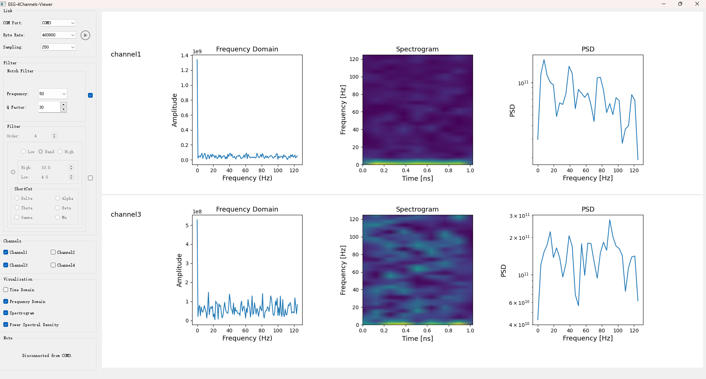

# EEG-Viewer

## 项目简介

本项目可实时显示脑电信号的时域与频域特征，可用于脑电信号的动态分析。

## 功能介绍

- 从串口实时读取EEG信号，当前代码对应的数据格式为：帧头（4）+有效数据（32） +校验1（1）+校验2（1），长度38字节；
- 数据预处理：包括滤波、去噪，并提供观测常见脑电波（alpha、beta等）的快速通道；
- 多通道：支持多通道个性化显示。

## 安装依赖项

```bash
pip install -r requirements.txt
```

## 运行项目

```bash
python main.py
```

## 示例



详见assets/demo.mp4
